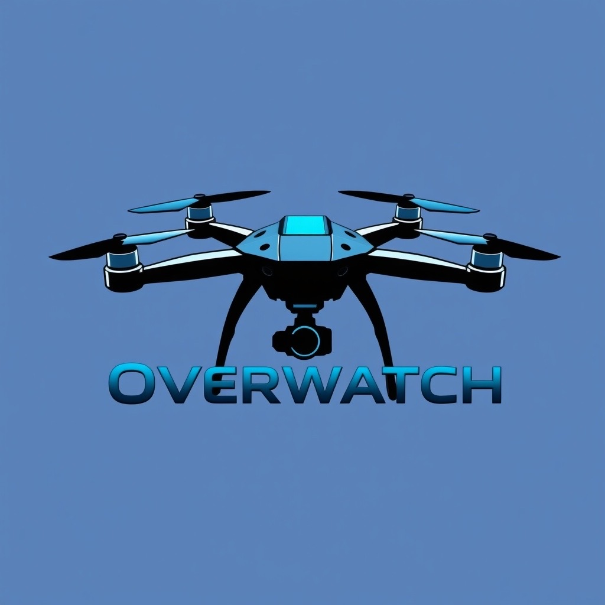

  

<h1 align="center">Overwatch Drone Services</h1>

  Precision from above — modern drone inspection, mapping, and 3D modeling solutions.

---

## 🚀 Overview

**Overwatch Drone Services** provides high-quality aerial inspections, 3D modeling, and mapping for real estate, construction, and commercial clients.  
Our mission is to make property visualization and documentation faster, safer, and more affordable using advanced drone technology.

This repository contains the **source code for our landing page**, built using **Jekyll**, **HTML/CSS**, and **JavaScript**.

**Live Site:** [khaledadad.com/drone-inspections-landing](https://www.khaledadad.com/drone-inspections-landing/)  
**Repository:** [github.com/khaloodi/drone-inspections-landing](https://github.com/khaloodi/drone-inspections-landing)

---

## 🧱 Project Structure

---

## 💡 Services Offered

| Tier | Description | Price |
|------|--------------|-------|
| **Basic Inspection** | Aerial imaging + visual site overview | $99 |
| **Premium Inspection** | Everything in Basic + annotated report, 3D modeling, and photogrammetry for construction planning | $149 |
| **Business / Multi-Property** | Tailored multi-site pricing for real estate and property managers | Custom |

> 🛠️ Additional capabilities under development:  
> - Drone mapping & 3D modeling using **DJI Mini 4 Pro**  
> - Software stack: **DJI Terra**, **Pix4D**, **Agisoft Metashape**, **QGIS**, **Blender**, **Jekyll**, and **Canva** for marketing assets.

---

## ⚙️ Tech Stack

| Layer | Tool / Framework | Purpose |
|-------|-------------------|----------|
| **Frontend** | HTML5, CSS3, JS | Responsive and lightweight design |
| **Site Generator** | Jekyll | Static site management and deployment |
| **Hosting** | GitHub Pages | Reliable and fast public hosting |
| **Design Assets** | Figma, Canva | Visual branding, logos, mockups |
| **3D Modeling** | Blender | Drone render and 3D reconstruction |
| **Mapping Software** | Pix4D, Agisoft Metashape, DJI Terra | Surveying and orthomosaic generation |

---

## 🧭 Vision & Roadmap

**Phase 1 (Current)**  
- Establish online presence and branding (logo, landing page, content).  
- Capture initial aerial content from partner properties (Dream House Builders).  
- Create demo inspection reports and 3D visualizations.

**Phase 2 (Next 3–6 Months)**  
- Expand drone data services: mapping, volumetrics, and site modeling.  
- Develop a dashboard for report delivery and project tracking.  
- Begin paid pilot programs with real estate and construction firms.

**Phase 3 (Future)**  
- Automate report generation with AI-assisted photogrammetry.  
- Launch a client-facing web portal with user logins and report history.

---

## 🤝 Partnerships

**Dream House Builders & Dream House Real Estate**  
Our first collaborative partner providing on-site access and initial inspection opportunities.

---

## 📸 Branding

- **Logo:** Overwatch (Blue Drone Emblem)  
- **Slogan:** “Precision from Above.”  
- **Primary Colors:** Deep Sky Blue (#007BFF), Charcoal (#222), and Light Gray (#F4F4F4)

---

## 💬 Contact

**Website:** [khaledadad.com/drone-inspections-landing](https://www.khaledadad.com/drone-inspections-landing/)  
**Email:** [coming soon]  
**Instagram:** [coming soon]  

---

© 2025 Overwatch Drone Services — All Rights Reserved.

